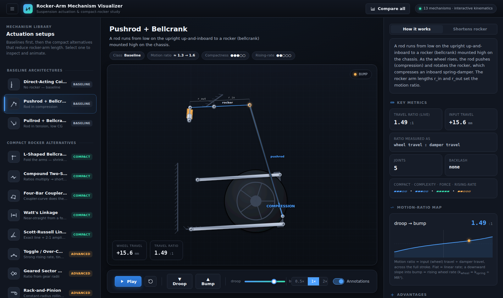

# Rocker-Arm Mechanism Visualizer

An interactive, animated study of the suspension actuation mechanisms used to drive a
spring-damper from wheel motion — and, specifically, the compact linkages that **reduce
the length of the rocker arm (bellcrank)** while still delivering the required motion
ratio and travel.

Open **`index.html`** in any modern browser. No build step, no dependencies.



## What's inside

**13 mechanisms**, grouped into:

- **Baseline architectures** — Direct-acting coilover, Pushrod + bellcrank, Pullrod + bellcrank.
- **Compact rocker alternatives** — L-shaped bellcrank, Compound two-stage rocker,
  Four-bar coupler actuation, Watt's linkage, Scott-Russell linkage, Toggle / over-centre,
  Geared sector rocker, Rack-and-pinion, Cam-and-follower, Slider-crank.

Each mechanism is a **real kinematic solver** (not a canned animation): positions are solved
every frame with circle–circle loop closure, four-bar and slider-crank equations
(`js/kinematics.js`). Drive it with the travel slider or play the bump↔droop cycle.

## Features

- **Accurate animation** of every linkage through full bump/droop travel.
- **Live motion-ratio readout + per-mechanism MR-vs-travel plot** (shows rising/falling rate).
- **On-canvas footprint comparison** — the equivalent long single-rocker envelope (red) vs the
  compact mechanism (green) — so the "shorten the rocker" thesis is *seen*, not just stated.
- **"Compare all" table** — sortable across ratio behaviour, rocker reduction, joints, backlash,
  force capacity, rising-rate and compactness.
- **Honest engineering labelling** — each mechanism states what its ratio number actually means
  and what its *primary* benefit is (packaging, amplification, rising rate, programmable ratio …).
  Footprint figures are research-grounded indicative estimates (see `RESEARCH.md`); the schematics
  are illustrative, not packaging-optimised.

## Project layout

```
Mechanisms/
├── index.html          # app shell (3-pane: library · stage · info rail)
├── css/styles.css      # engineering-grade dark design system
├── js/
│   ├── kinematics.js   # planar linkage solver library (pure functions)
│   ├── renderer.js     # SVG scene renderer (metallic links, coil springs, gears, cams…)
│   ├── mechanisms.js   # the 13 mechanism definitions: geometry, solvers, metadata
│   └── app.js          # UI wiring, animation loop, MR plot, comparison table
├── RESEARCH.md         # the deep-research findings the geometry is built on
└── README.md
```

## Intended use

A finished, shareable artifact to walk an engineering team through the concepts before they
commit to real CAD. Every mechanism includes how it works, how it shortens the rocker, its
trade-offs and where it is used in industry (F1, FSAE, LMP, MTB/moto, machine design).

## Notes & caveats

- Geometry is 2-D and schematic. Coordinates are millimetre-scale and internally consistent,
  but the layouts prioritise clarity over being manufacturable packages.
- Motion-ratio numbers are computed from each mechanism's own geometry; the **"ratio measured as"**
  note tells you the exact input/output pair, since the meaning differs between mechanisms.
- Fonts load from Google Fonts when online; offline it falls back to system fonts.
